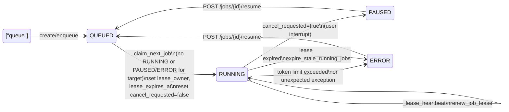

# Queueing and Execution Architecture

This document outlines how the job queueing, execution, cancellation, and resume mechanisms work. It summarizes the cross-worker guarantees driven by the database and the local bookkeeping that exists only within a single worker process.

## Key entities
- **Job**: persisted with fields including `status`, `lease_owner`, `lease_expires_at`, and `cancel_requested`.
  - `status ∈ {PENDING, QUEUED, RUNNING, PAUSED, ERROR, SUCCESS, CANCELED}`.
- **Worker**: an async loop per tenant that claims jobs, runs them, and maintains a heartbeat lease. Number of workers are configured per tenant.
- **Lease**: database-backed ownership via `lease_owner` and `lease_expires_at` to ensure a single worker executes a job and to detect stale workers.

## Queueing and claim (cross-worker safe)
- Jobs are created and moved to `QUEUED` by `enqueue_job`.
  - Picks the oldest `QUEUED` job such that the target has no `RUNNING` job and no `PAUSED`/`ERROR` jobs (these pause the target queue).
  - Sets `status = RUNNING`, assigns `lease_owner = WORKER_ID`, sets `lease_expires_at = now + lease`, and clears `cancel_requested = False` to avoid stale cancellations.
  - Uses an advisory transaction lock per target and `FOR UPDATE SKIP LOCKED` to guarantee single-claim across workers.

## Execution and heartbeat
- For each claimed job, the worker starts two asyncio tasks:
  - The execution task: `execute_api_in_background_with_tenant(job, tenant_schema)`.
  - The lease heartbeat task: `_lease_heartbeat(job, tenant_schema, exec_task)`.
- Heartbeat runs every 2s:
  - Renews the lease (`renew_job_lease`).
  - Checks `cancel_requested` in DB; if true, cancels the execution task (`exec_task.cancel()`), then exits.

## Cancellation semantics (cross-worker)
- Any process can call `request_job_cancel(job_id)` → sets `cancel_requested = True` in DB.
- The worker owning the job will observe this via the heartbeat and cancel the execution task.

## Stale worker protection
- `expire_stale_running_jobs()` marks `RUNNING` jobs as `ERROR` when `lease_expires_at < now` or a lease is otherwise invalid, ensuring the system recovers from worker failures.

## Resume flow
- `POST /targets/{target_id}/jobs/{job_id}/resume/` allows resuming a `PAUSED` or `ERROR` job.
- Resume sets the job to `QUEUED`. On the next claim, `cancel_requested` is cleared and a fresh lease is established, enabling clean re-execution.

## State diagram

## Operational notes
- A `PAUSED` or `ERROR` job blocks further jobs for that target from being claimed (target queue pause). Clearing/Resolving or Resuming allows the queue to continue.

## Graceful shutdown (drain mode)
- On process shutdown (e.g., SIGTERM), the server enters a drain mode:
  - **Stop claiming new jobs**: worker loops exit before calling `claim_next_job`, so only currently running jobs continue.
  - **Wait for in-flight jobs**: the shutdown hook waits up to `SHUTDOWN_GRACE_PERIOD_SECONDS` (default 300) for running jobs to complete.
  - **Timeout behavior**: if the grace period elapses, remaining in-flight tasks are cancelled. Cancellation marks jobs as `PAUSED` with a message "Job was interrupted by user" (unless token-limit driven).
